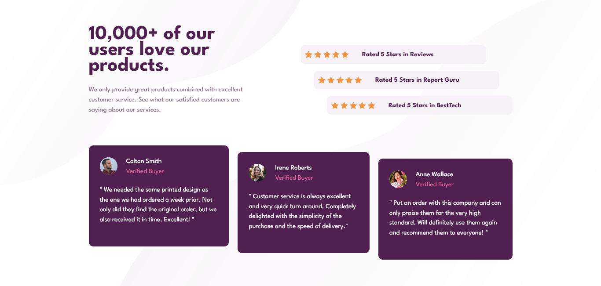
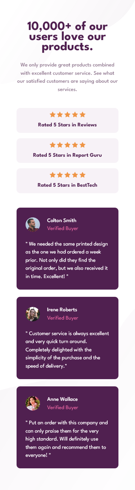

# Frontend Mentor - Social proof section solution

This is a solution to the [challenge Social proof section on Frontend Mentor](https://www.frontendmentor.io/challenges/social-proof-section-6e0qTv_bA). Frontend Mentor challenges help you improve your coding skills by building realistic projects. 

## Table of contents

- [Overview](#overview)
  - [The challenge](#the-challenge)
  - [Screenshot](#screenshot)
  - [Links](#links)
- [My process](#my-process)
  - [Built with](#built-with)
  - [What I learned](#what-i-learned)
  - [Continued development](#continued-development)
  - [Useful resources](#useful-resources)
- [Author](#author)

## Overview

### The challenge

Users should be able to:

- View the optimal layout depending on their device's screen size

### Screenshot




### Links

- Solution URL: [Social proof section](https://github.com/Kevhec/frontEndMentor/tree/master/projects/Social_proof_section)
- Live Site URL: [KevHec - Social proof section](https://kevhec.github.io/frontEndMentor/projects/Social_proof_section/)

## My process

### Built with

- Semantic HTML5 markup
- CSS custom properties
- Flexbox
- CSS Grid
- Mobile-first workflow

### What I learned

From this project I liked the way I used the *backgound-repeat* in order to avoid cloning the star icon in the score section of my html.

```css
.rating-stars {
    background-image: url(../images/icon-star.svg);
    background-repeat: space;
    width: 100px;
    height: 16px;
}
```

### Continued development

Positioning is one of my main focuses with CSS in this moment of my learning process, but I'm also interested on knowing other ways to use properties that were not made for that specific purpose.

### Useful resources

- [MDN - background-repeat](https://developer.mozilla.org/en-US/docs/Web/CSS/background-repeat) - This is the documentation I used for the *background-repeat* property.

## Author

- Frontend Mentor - [@Kevhec](https://www.frontendmentor.io/profile/Kevhec)
- Twitter - [@Kev_Hec](https://twitter.com/Kev_Hec)